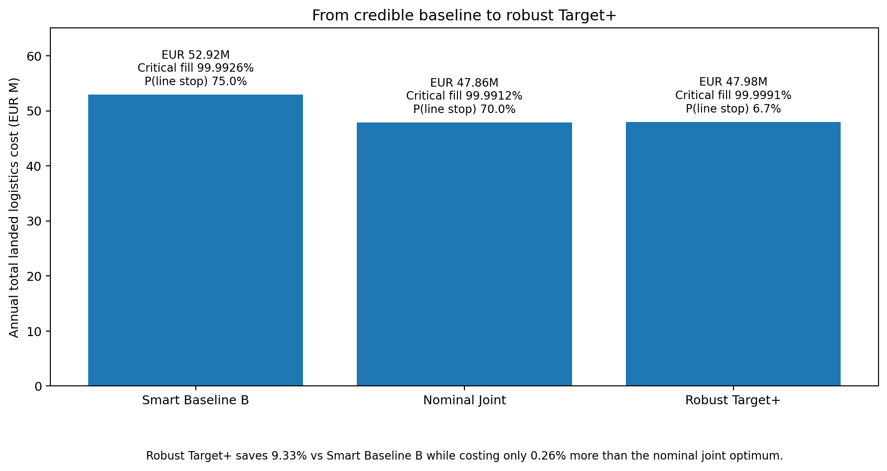

# Automotive Supplier Packaging & Inbound Logistics Optimization

**Robust joint packaging, replenishment, inbound routing, inventory and returnable-container decision support under uncertainty.**

> **Research-grade synthetic automotive inbound logistics study.** No Ferrari/OEM data, no industrial validation claim, and no digital-twin claim.

## Executive result

**60 suppliers | 600 parts | 57 Target+ routes | 42/42 tests**

| Decision benchmark | Annual total landed cost | Critical fill | P(at least one line stop) |
|---|---:|---:|---:|
| **Smart Baseline B** | **EUR 52.92M** | **99.9926%** | **75.0%** |
| Nominal Joint | EUR 47.86M | 99.9912% | 70.0% |
| **Robust Target+** | **EUR 47.98M** | **99.9991%** | **6.7%** |

**Defensible saving vs Smart Baseline B: 9.33%**  
**Robustness premium vs nominal optimum: 0.26%**



### The result that survived the red-team

The original weak-baseline comparison suggested approximately **40.2% savings**. That result did **not** survive a stronger benchmark.

**Weak baseline: ~40.2% saving**  
**↓ replace with compatible packaging + clustering + simple milk-runs + ROP inventory**  
**Credible Baseline B: 9.33% robust saving**

This is a strength of the project, not a defect. A smaller result that survives a credible baseline, stochastic operations and out-of-sample stress is more decision-useful than a large result created by a weak comparator.

> **A robust 9% saving against a credible baseline is much stronger than a fragile 40% saving against a weak baseline.**

## Management recommendation

Choose **Target+**, not the nominal cheapest policy. The nominal joint network costs **EUR 47.86M/year**; Target+ costs **EUR 47.98M/year**, only **0.26% more**, while materially reducing modeled interruption risk through selective critical-material protection.

The project therefore answers a management question, not an algorithm question:

> **What packaging, shipment frequency, consolidation, routing and inventory policy minimizes total landed logistics cost while preserving line-side availability and resilience under uncertain demand and supplier performance?**

## What management should not miss

### Tail risk remains material

A high average fill rate is not the same as a resilient production system.

- Target+ nominal critical fill: **99.9991%**
- Nominal P(at least one line stop): **6.7%**
- OOS Target+ critical fill: **99.9046%**
- OOS P(at least one line stop): **48.0%**
- Combined-shock critical fill: **97.34%**
- Combined-shock P(at least one line stop): **100%**

The primary failure region is the interaction of **carrier capacity + demand shock + container availability**. There are **28 suppliers with TTS < TTR**, with a worst synthetic resilience gap of **5.73 days**.

### Returnables require more fleet than the theoretical minimum

Returnable packaging is modeled as an asset loop, not as free packaging.

- Theoretical fleet: **129,888 containers**
- Operational fleet: **150,272 containers**
- Operational allowance: **+15.7%**
- Median returnable/expendable break-even: **69.4 cycles**

The allowance reflects turnaround, attrition and operating protection; container conservation is explicitly tested.

### CO2 is baseline-dependent

Target+ transport emissions are **3.347 ktCO2e/year**.

- **-13.83% vs Smart Baseline B**
- **+0.29% vs simple Baseline A**

The repository therefore does **not** claim that optimization is universally greener. Transport CO2e accounting is kept separate from synthetic packaging-lifecycle proxies.

### Economics remain attractive inside the synthetic uncertainty range

The investment case uses **4,096 Monte Carlo draws**:

- 5Y NPV P5: **EUR 3.15M**
- 5Y NPV P50: **EUR 6.39M**
- 5Y NPV P95: **EUR 9.49M**
- Median payback: **2.39 years**

`P(NPV > 0) = 100%` **inside the specified synthetic uncertainty range**. This does not imply industrial certainty; real carrier rates, lead-time distributions, container turnaround, stockout history and damage data could materially change the decision.

## Why joint coordination matters

Sequential packaging -> routing -> inventory produces approximately **EUR 51.25M/year**. The nominal joint policy reaches **EUR 47.86M/year**, about **6.62% lower**, because packaging density, shipment cadence and transport-capacity feasibility are coordinated before downstream routing and inventory evaluation.

The final Target+ policy preserves most of that economic value while adding downside protection.

## Physical credibility controls

The release enforces or verifies:

- payload, usable cube and pallet-position capacity;
- physically feasible shipment frequency;
- route duration and feasibility flags;
- finite receiving docks and non-negative waiting;
- inventory policy consistency;
- premium-freight and line-stop recourse;
- returnable-container conservation;
- transport-emissions unit reconciliation;
- cost-component reconciliation to total landed logistics cost;
- stochastic reproducibility and out-of-sample policy comparison.

**42/42 automated tests pass in the GitHub distribution.**

## Repository navigation

Start here:

1. [`outputs/FINAL_QA_REPORT.md`](outputs/FINAL_QA_REPORT.md) - final credibility and reconciliation audit.
2. [`docs/technical_thesis.md`](docs/technical_thesis.md) - full technical narrative and evidence.
3. [`outputs/final_summary.json`](outputs/final_summary.json) - machine-readable release source of truth.
4. [`data/processed/policy_comparison.csv`](data/processed/policy_comparison.csv) - Baseline A/B, sequential, nominal and Target+ economics/service.
5. [`data/processed/oos_summary.csv`](data/processed/oos_summary.csv) - out-of-sample service evidence.
6. [`data/processed/stress_suite.csv`](data/processed/stress_suite.csv) - disruption and failure-region evidence.
7. [`data/processed/cost_component_bridge.csv`](data/processed/cost_component_bridge.csv) - accounting saving attribution.
8. [`docs/RECRUITER_BRIEF.md`](docs/RECRUITER_BRIEF.md) - CV bullets, interview story and GitHub metadata.

### Repository structure

```text
src/aspilo/       quantitative model modules
data/raw/         reproducible synthetic masters and demand
data/processed/   selected decision outputs and validation evidence
configs/          model configuration
scripts/          staged reproducible experiments
outputs/          final summary, solver evidence and QA
figures/          final decision-support visuals
tests/            physical, financial and stochastic verification
docs/             thesis, research basis, limitations and recruiter brief
```

## Reproduce the final evidence

```bash
python -m pip install -r requirements.txt
python scripts/01_build_policies.py
python scripts/02a_oos.py
python scripts/02b_stress.py
python scripts/02c_envelope_ablation.py
python scripts/03_returnables_packaging.py
python scripts/04_sensitivity_economics.py
pytest -q
```

The staged design avoids accumulating unnecessary stochastic state in one monolithic run.

## Methodological boundary

The packaging-frequency MILP reports solver evidence and reaches **MIP gap approximately 0** for the synthetic instance. Downstream milk-run construction is a physical, capacity-feasible heuristic; the repository does **not** claim exact global CVRPTW/IRP optimality.

External research supports model design rather than the numerical results. The research basis is documented in [`docs/research_basis.md`](docs/research_basis.md), including ISO 14083:2023, the Smart Freight Centre GLEC Framework, AIAG returnable-container guidance and MIT CTL inbound logistics/resilience research.

The next meaningful scientific step would require **industrial data for empirical calibration and external validation**, not additional routing or optimization algorithms.
